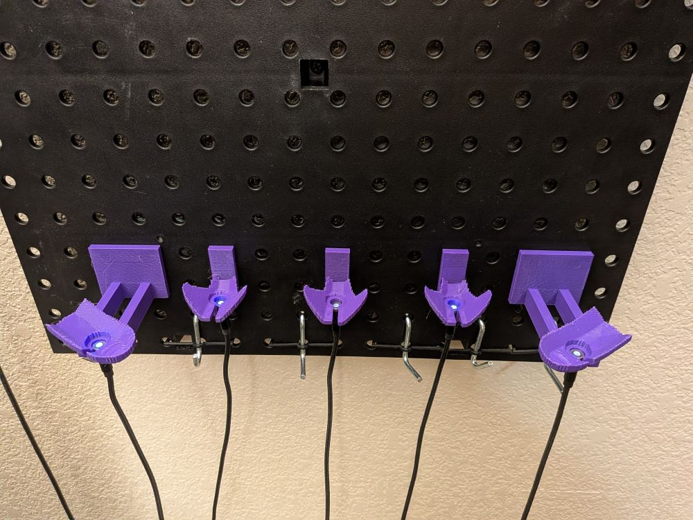
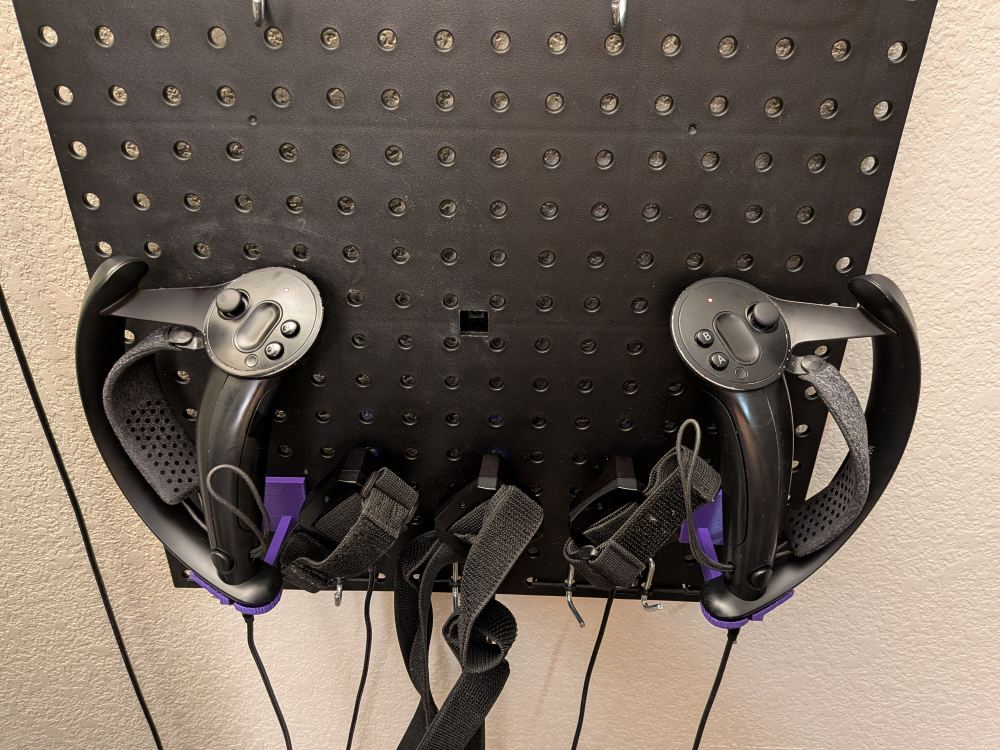
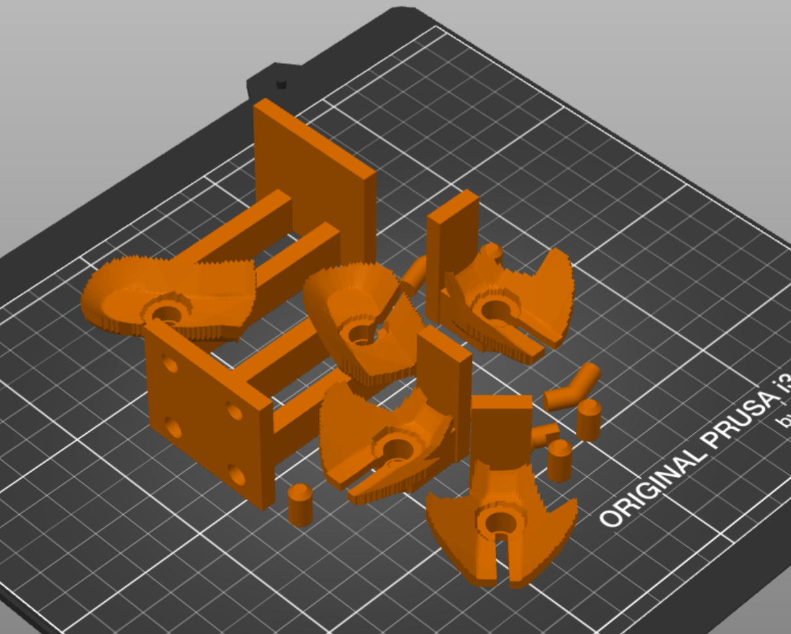

# VR Pegboard

3D-printable pegboard mounts for Valve Index controllers and Tundra trackers and magnetic USB-C charging cables:

| empty | mounted | sliced |
| --- | --- | --- |
|  |  | 

Almost entirely built with Claude 4.8 Opus writing [build123d](https://github.com/gumyr/build123d) code from text descriptions (+ a bit of Fable 5 until they shut it down).

The exact USB-C charging cables I use are [these ones on amazon](https://www.amazon.com/dp/B0BNGGHMH2), but I think they're the same as the ones EOZ or other brands sell too.

### Printing

Download STLs from the [github releases](https://github.com/hiinaspace/vrpegboard/releases/). Print the mounts in natural orientation with supports for the cup parts. I use really minimal lightning infill since most of the strength is in the perimeters anyway.

The pegs for the pegboards are separate parts so you don't have to support them. The bottom pegs can print upright but you might want to print the top pegs on their side for better lateral strength + small brim for bed adhesion. I attached the top pegs with hot glue but just pressed in the bottom pegs (they don't carry any load really).

### So how well can Claude actually do CAD?

It does okay. It managed to translate even my primitive vocabulary for mechanical engineering ("the cable should uh, fit into the hole"), basic caliper measurements, and reference STEP files for the index controllers and tundra trackers into pretty well-parameterized model. I didn't have to e.g. explain how pegboards work for it to handle the pegs and backplate.

Its vision and world modeling are poor though. E.g. I could tell from a glance when it was physically impossible to get the cable into place without a side slot, or that you could rotate the controller to require less of a standoff. I also had to actually open freeCAD myself and mark the center and plane of the USB-C charging ports, since the vendor STEP files don't label those. There are some automated "fit tests" that attempt to make up for the model's shortcomings, but at least for the next few dozen months my fleshy eyes and hands were necessary. (Fable 5 does have better vision than 4.8 though, for the few sessions I got out of it; I think it might've been able to mark the USB-C ports itself and judge physical impossibility even where 4.8 could not).

# Readme (slop) below

Parametric, 3D-printable charging mounts for VR gear that snap into a **1"
pegboard**. Each mount holds a device securely and presents a round magnetic
USB-C cable so the device charges as it seats.

Scope: 2× Valve Index controllers (L + R) and 3× Tundra trackers.

## Quick start

```sh
uv sync --extra view --extra analyze  # build123d + OpenCascade; viewer; mesh/print analysis
uv run python fetch_models.py         # download vendor STEP CAD into vendor/
uv run vrpegboard                     # export STLs into out/ (+ overhang summary per part)
uv run pytest                         # solid-validity / bed-fit / peg-pitch checks
uv run python -m vrpegboard.fitcheck index   # drop-in / cable slot / socket-wall checks
uv run python -m vrpegboard.fitcheck tundra
uv run python -m vrpegboard.printability out/*.stl # overhang + (if installed) PrusaSlicer stats
```

The cups are **surface-conforming**: `conform.py` ray-casts the posed device mesh
straight up the hang axis into a depth raster (the body's lower envelope), then
builds the cup under it. A heightfield is single-valued in z, so the device still
drops straight in with no undercut, but the inner surface now *matches* the
device's bottom instead of a flat-floored prism. Each dock fuses in mesh space
(`manifold3d`) — the raster is low-poly so its booleans are cheap and robust,
unlike a B-rep boolean against the ~390k-triangle vendor mesh. Two cup methods are
selectable to compare in the viewer: `solid` (a conforming block) and `shell` (a
thin conforming skin).

Print **`out/index_cup_test.stl` first** (the Index cup alone, no bracket/pegs):
drop the real controller + cable in on the desk to validate the seat / magnet
mate and judge stability before committing to the full docks.

### Seeing it against the wall

Two ways to eyeball the pose/standoff before printing:

- **Live 3D (recommended for tuning).** `ocp_vscode` (the `view` extra) ships a
  standalone **browser** viewer — no VS Code needed:

  ```sh
  uv run python -m ocp_vscode      # once: opens the viewer at localhost:3939
  uv run python scene.py index solid   # Index dock (solid cup) + controller + board
  uv run python scene.py index shell   # ...the thin-shell cup, to compare
  uv run python scene.py tundra solid  # ...or the Tundra
  ```

  Tweak a knob (`AZIMUTH`/`STANDOFF`/`CUP_METHOD` in `index_controller.py`, or the
  Tundra `CUP_METHOD`/`CRADLE_*`) and re-run `scene.py`; the viewer updates in place
  so you can rotate the assembly against the grey board panel and judge "will this
  look right against my wall". dock = blue, device = orange, pegs = green, board = grey.

- **Headless PNGs.** `uv run python preview.py` renders three orthographic
  scatter views (`out/preview_*.png`) with the same colour key — handy in a
  terminal-only session or for a quick diff.

## How the docks are generated

The magnetic cable carries the device's weight; the dock's job is to **hold the
charging port facing straight down** so the connector loads in compression (no
peeling moment to pop the magnet) and to register the device against swinging.
Both docks are built from the vendor STEP geometry, not hand-modelled:

1. import the STEP and **auto-pose** it so the charging port faces straight down
   (board −Z). The Index then spins about that vertical hang axis (`AZIMUTH`
   ≈90°) so the **trigger faces the board** and the wide tracking ring lies along
   X (to the side); the Tundra hangs from its marked port and rolls the dome to
   the most compact orientation that clears the board;
2. **stand the connector off the board** far enough that the whole hanging
   device clears it — solved automatically (Index ~62 mm, since trigger-to-board
   still sweeps the ring boardward; Tundra ~20 mm). The Index rides a thin two-web
   bracket out to a 2×2 peg grid; the Tundra a short neck + backplate;
3. **conform to the device's bottom**: `conform.py` ray-casts the posed device's
   bottom ~20 mm looking up the hang axis into a depth raster and builds a cup
   whose inner surface matches it — the grip (Index) / dome (Tundra) rests on a
   matching surface. A heightfield is single-valued in z, so it still drops
   straight in. Both **port frames** are marked in FreeCAD, not guessed (see
   *Marking the port*);
4. sink the cable's **magnetic discs + barrel lead-in** into a stepped
   `connector_socket` in the cup floor (see *Charging cable retention*), a
   full-height side slot letting the cable press in and the barrel + cable hanging
   free below. Everything fuses in mesh space into one printable piece per dock,
   plus the separate glued pegs.

All docks are single watertight meshes (one connected body, exported STL —
asserted in the tests); the conforming surface comes from a ray-cast raster, and
booleans run on that low-poly raster, never on the raw vendor mesh.

## Marking the port

The vendor Index STEP models the USB-C port only as a recess and gives no axis — and the
real port is **off-centre and tilted ~20° off the handle axis**, so guessing it from the
handle-bottom centroid (the old approach) put the cable clamp ~9 mm off. Instead:

1. `uv run python -m vrpegboard.portmark` renders solid **depth views** of the handle
   underside (`out/port_*.png`) at a recorded mm scale, where the recess is visible.
2. In FreeCAD, draw a rectangle on the port face (a sketch coplanar with it) and **export
   it to both `.step` and `.3mf`**. The STEP carries the rectangle in the sketch's local
   plane; the `.3mf` `<build>` transform carries that plane's placement on the controller —
   together they recover the port's 3-D position + normal.
3. `portmark.port_frame_from_marked_step("vendor/...port_rect.step")` reads them, maps into
   the canonical pose, and prints `PORT_XY` / `PORT_Z` / `PORT_AXIS` to paste into
   `index_controller.py`.

The **Tundra** port is marked the same way (its USB-C recess sits on the dome's side
wall, so the seed-window centroid lands slightly off). Draw the outline + a centre
point on the port face in FreeCAD, export `vendor/tundratracker-chargingportsketch`
to both `.step` and `.3mf`, then `uv run python -m vrpegboard.portmark tundra` prints
`PORT_C` / `PORT_AXIS_N` (the port centre + outward normal in the raw STEP frame) to
paste into `tundra_tracker.py`. `_posed` then hangs the tracker on that exact axis.

## Checking fit before printing

`uv run python -m vrpegboard.fitcheck index|tundra` runs **geometric** (not
physics) checks in mesh space: it slides the real-size device up its hang axis and
reports interference vs height (a clear path = no undercut; snug seated contact is
fine), plus seated board clearance; it drops the **real magnetic connector** onto
the seat and checks it fits the bores with ~0 interference (the test the first
socket failed); it confirms the cable slot vents to air; and it probes rings of
points around the socket bores and each peg pocket to confirm full walls.
`printability.py` reports overhang area / a low-overhang orientation and, if
PrusaSlicer (flatpak) is installed, real slice time / filament / support stats.

## How the pegboard hook works

The top hook is **one circular profile swept along a smooth path**: straight
through the hole, then a filleted bend climbing up-and-back behind the board. To
mount, angle the whole part up so the hook lines up with the hole, slide it
through, then lower it to vertical — the hook swings behind the board and
**gravity locks** it (it can't pull out without lifting + tilting again). A lower
straight peg one pitch down stops rotation: it's **longer** than the board
(~+5 mm, so part flex can't walk it out of its hole) and **snugger** than the
hook (the hook stays a loose slide fit — it does the holding, not a tight peg;
the lower peg's closer fit is what kills left/right twist). Because the bend is a
single smooth curve at ~45° (no flat overhang), the hook prints lying on its side
without support material. Tune the bend with `Pegboard.hook_bend_radius`.

**The pegs are separate, glued parts.** The connector socket outgrew the old
"whole part ≤7 mm thick, printed on its side" trick, so each dock body prints in
the orientation its cup/cradle wants while the pegs print side-lying. Each peg has
a stub that glues into a blind hole through the dock's back; the hook's stub and
hole are **D-profiled** so it can only go in with its tang pointing up. The Tundra
uses one column (a hook + a lower peg); the **Index uses a 2×2 grid** (two hooks,
two lower pegs, a pitch apart) so its long ~83 mm cantilever can't twist —
`peg_holes(cols)` and `placed_pegs(cols)` take the column offsets.

## Charging cable retention

The charging interface is **two magnetic discs** — a USB-C adapter that stays in
the device's port + the cable's magnetic head — that stack to Ø8 × 7.5 mm and sit
**below the device's port face**, with a rigid swivel barrel (Ø6.6, ~20 mm) and
then the flexible 3 mm cable trailing off them. The first socket was far too
shallow (~Ø7.5 × 10 mm) for that stack, so the magnet end physically wouldn't
seat. The `connector_socket` now matches the measured stack:

- a **Ø8.4 mm bore, 10 mm deep** below the cup/cradle floor — deeper than the
  7.5 mm stack on purpose (the extra ~2.5 mm is recess/lift travel, see below);
- a **Ø7.0 mm bore, 3 mm deep** gripping the start of the barrel; the step
  between the two stops the disc;
- **open below** — the rest of the barrel + cable hang free (no point
  encapsulating them).

The bore runs **deeper than the mated stack** so the cable head can rest
**recessed** ~5 mm below the seat when the device is off. The device's magnetic
adapter protrudes ~4.5 mm below its port face, so when the body seats in the cup
the magnet **lifts the cable up to couple** while the cup still carries the
weight — instead of the body balancing on top of the cable held by the barrel
grip (the earlier 7.5 mm bore left no recess, so the whole device perched on the
cable). The `scene.py` overlay models the device adapter (silver) + mated cable
(black) so you can eyeball this in the OCP viewer.

Assembly is **top-loading**: drop the magnet head + barrel into the bores from
above (before the device goes in), the barrel hanging out the open bottom; a
cable-width **side slot** lets the flexible cable route out. The device then
seats on the cup floor with its port face over the bore, the magnet pulling it
down — the swivel can no longer pivot it over.

## Status

- ✅ Split peg parts (swept hook + lower peg, glued), the magnet-stack connector
  socket, **Index controller dock (L + R)** + `index_cup_test`, **Tundra tracker
  dock** (×3, identical). Both hang the device **port straight down**.
- The **Tundra** dock: a **surface-conforming cup** of the dome's lower band over
  the socket, hung on the FreeCAD-marked port and rolled compact, stood off ~20 mm
  on a short neck + backplate so the dome clears the board. Prints upright on its
  flat base. (~40 × 41 × 39 mm.)
- The **Index** dock: a **surface-conforming cup** of the controller's bottom
  ~20 mm (grip wrapped, tracking ring left to a clearance channel) over the socket,
  carried ~62 mm off the board on a **two-web bracket** to a **2×2 peg grid** (the
  long cantilever can't twist; the cable hangs down the centre between the webs).
  **Trigger faces the board, ring to the side** (`AZIMUTH` ≈90°). (~49 × 80 × 39 mm.)
- Each dock builds with `CUP_METHOD = "solid"` or `"shell"`; `scene.py <dev> <method>`
  pushes either to the viewer to compare.
- `pytest` asserts the construction invariants (one watertight piece with the arms
  fused, drop-in with no undercut, board clearance, full-height slot venting, the
  magnet hole breaching the floor, the cable fitting the bores). `fitcheck
  index|tundra` prints the same as advisory diagnostics. **Print `index_cup_test`
  first** (the cup alone) to validate the seat / mate height before the full docks.

## Tuning

All dimensions live in `src/vrpegboard/params.py`. After a test print, adjust
there:

- `Pegboard.peg_clearance` (hook slide fit), `lower_peg_clearance` /
  `lower_peg_extra` (anti-twist peg fit/length), `peg_glue_clearance` /
  `peg_key_flat` (the glued stubs), `hook_angle`, `hook_bend_radius`,
  `catch_rise` / `catch_clearance` (the hook behind the board), `board_thickness`.
- `Connector.magnet_dia` / `magnet_depth` (the disc stack), `shroud_dia` /
  `shroud_bore_depth` (the barrel lead-in), `magnet_clearance` /
  `shroud_clearance` (slip fits), `cable_slot_width`, `socket_wall`.

Per-device pose/fit knobs live atop the device modules:

- `index_controller.py` — `CUP_METHOD` (`"solid"`/`"shell"`), `CUP_DEPTH` (how much
  of the bottom the cup wraps), `CUP_CLEARANCE`, `CUP_WALL`, `CUP_MAX_R` (how far the
  cup reaches before it leaves the ring to a clearance channel); `AZIMUTH` (spin about
  the hang axis — ≈90° = trigger to board / ring to the side), `STANDOFF` (`None` =
  auto-solve board clearance), `BOARD_CLEARANCE`; `WEB_THICK` / `WEB_OFF` (bracket webs).
- `tundra_tracker.py` — `CUP_METHOD`, `CRADLE_H` (band height), `CRADLE_WALL` /
  `CRADLE_CLEAR` (shell thickness / drop-in gap), `CUP_MAX_R`, `BOARD_CLEAR`,
  `ATTACH_Z`; `PORT_C` / `PORT_AXIS_N` (the FreeCAD-marked port) with the seed window
  as fallback.

## Attribution / licenses

Vendor CAD is downloaded locally and **not redistributed** here (`vendor/` is
gitignored); check each source's terms before sharing derived geometry.

- Valve Index controller CAD — [ValveSoftware/IndexHardware](https://github.com/ValveSoftware/IndexHardware) (Creative Commons).
- Tundra Tracker developer model — [Tundra Labs docs](https://tundra-labs.github.io/tundra-tracker-docs/tracker_customization/).
- Pegboard hook geometry inspired by (not copied from)
  [pegstr](https://github.com/MGX3D/pegstr) and the
  [build123d pegboard hook](https://www.printables.com/model/343714-pegboard-hooks-build123d-customizable).

## Reference docks (for design ideas)

Existing hand-built docks worth studying before tuning — open the pictures/models
to see how they hold the device, then translate into the band knobs above:

**Tundra trackers** (cradle very little; the straps/USB/magnet bear the weight):

- [Tundra Tracker Wall Charger — DevoCut (Printables)](https://www.printables.com/model/185755-tundra-tracker-wall-charger)
  — shallow cups that are "just a guide to find the USB port", charges with
  straps on; the model for our Tundra cup (ours adds the swivel-capture socket).
- [Magnetic Charging Dock, Seven Bay, EOZ cables — Tsumitsuki (Thingiverse)](https://www.thingiverse.com/thing:5426361)
  — multi-bay, fits the official EOZ magnetic cable (same family as ours).
- [Magnetic Charging Dock, Seven Bay, NetDot Gen10 — Tsumitsuki (Thingiverse)](https://www.thingiverse.com/thing:5426357)

**Valve Index controllers** ("cup" the controller hanging port-down):

- [Index Controller charging holder — (Thingiverse 3728198)](https://www.thingiverse.com/thing:3728198)
  — the `box - controller` style our Index holder now uses: the controller's bottom
  is subtracted from a block so it nests in and rests on full contact, with a cable
  hole + lateral slot. Prints cleanly (only the pegboard pins want minor support).
- [Index Controller Charging Stand — jhawkn8r (Thingiverse 3339091)](https://www.thingiverse.com/thing:3339091)
  — the cleanest "cup around the base" rendition (holds the controller
  dead-vertical, which we angle out to clear the board).
- [Index Controller Magnetic Charging Stand — cups (Thingiverse)](https://www.thingiverse.com/thing:4797751)
- [Valve Index wall mount with controller charging dock (Printables)](https://www.printables.com/model/494201-valve-index-wall-mount-with-controller-charging-do)
- [valve index controller stand — STLFinder roundup](https://www.stlfinder.com/3dmodels/valve-index-controller-stand/)
